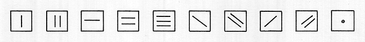
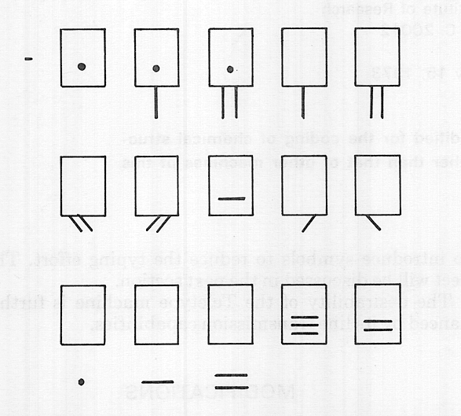
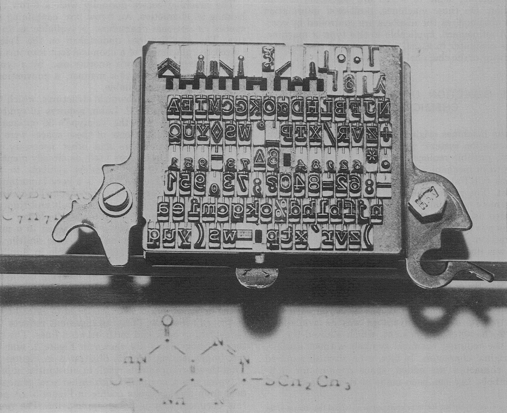
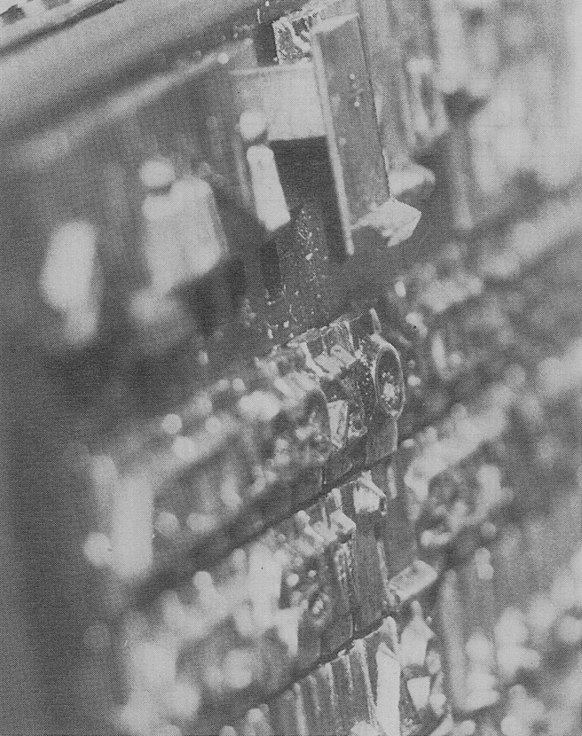
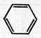
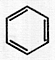
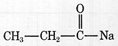
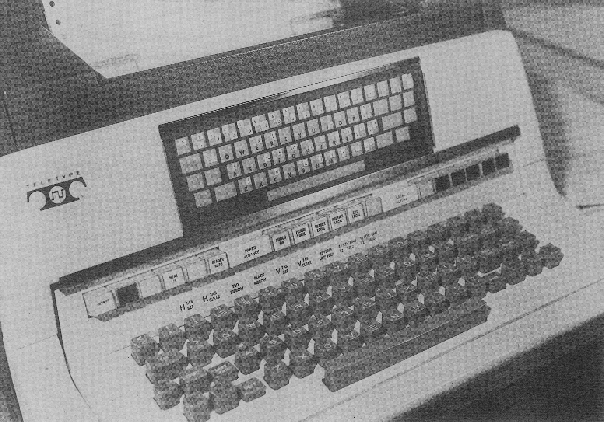
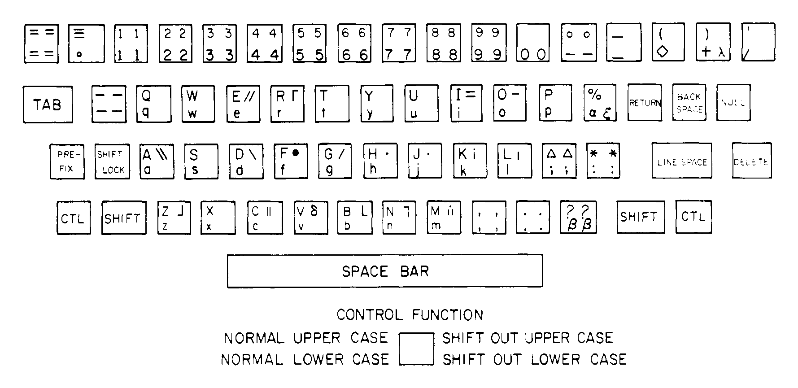

*Source*: <https://pubs.acs.org/doi/abs/10.1021/c160049a003> [[Sci-Hub](https://sci-hub.st/10.1021/c160049a003)]

# A Chemical Teletype*

ALFRED FELDMAN \
Walter Reed Army Institute of Research \
Washington, D. C. 20012

Received January 15, 1973

\*The findings in this report are not to be construed as an official Department
of the Army position.

Journal of Chemical Documentation, Vol. 13, No. 2, 1973

**A Teletype Model 37 machine has been modified for the coding of chemical
structures. The coding rate of this machine is higher than that of other
machines of this type.**

The mechanical coding of chemical structures was introduced in the early
1960’s.1 It was achieved by furnishing a typewriter, first with an
appropriate font, and second, with a means for coding both the typed characters
and their locations on the typewritten page.

The first machines achieved this positional coding by sensing coordinates. As
typewriters equipped with a so-called “reverse line feed” became commercially
available, an alternative method, yielding equivalent information, became
attractive. In this method, all function keys—i.e., back space, line advance,
reverse line feed, etc.—generate codes, and all positioning is done through the
use of these keys alone.2 From the coded sequence, the position of
each typed character is therefore readily deduced.

Subsequently, keyboard operated CRT consoles have become available, some of
which are amenable to font modification. On these machines, positional
information is always obtained, as the displays are controlled by coordinates. A
refinement, applicable to this type of machine, allows the computer to assist
the operator of the machine in the drawing of the chemical
structure.3

## THE SELECTION OF A MACHINE FOR CHEMICAL INPUT

Since the machines originally developed for the Walter Reed information
system4 were approaching their normal retirement, possible
replacements were investigated.5 The choice between mechanical
devices (typewriters) and electronic ones (CRT’s) was resolved mainly on the
basis of initial cost. The greater speed of the CRT’s, when operated as remote
terminals, was not taken into account, as the intended use of these machines was
predominantly for input, which is an operation limited by typing speed. The
error correction problem, a disadvantage of tape typewriters, also was deemed of
little account, as it is minimized in positional coding,6 as well as
through the use of magnetic (erasable) tape. The refinement of computer assisted
drawing, not being commercially available, was not considered.

Of the typewriters considered, the Teletype Model 37 was selected. Its decisive
advantage was its availability with a 126-character complement, which allowed
the addition of the required chemical symbols without sacrificing the original
characters. In fact, even after all required chemical characters are added,
space remains for additional symbols. Use has been made of this extra capacity
to introduce symbols to reduce the typing effort. This aspect will be discussed
in the next section. The desirability of the Teletype machine is further
enhanced by its line transmission capabilities.

## MODIFICATIONS

For ease of subsequent servicing, the basic Teletype machine was modified as
little as possible. Since the machine is obtainable with a “reverse line feed”
function, it was adapted to the indirect method of coding character positions.
Consequently, the machine obtained differs from production models only in the
substitution of a “chemical” type box for the standard one.

The machine comes normally with a 6-row type box, holding 96 characters. An
8-row box, containing about 30 spaces for optional characters, is available as
an alternative. The modifications undertaken on the Teletype involved the
placement of a chemical font into this box. The box can be replaced with another
one, by a typist, in a matter of seconds. In this manner, a conventional
teletypewriter is always available.

The font for typing chemical structures, which was originally proposed by H. P.
Luhn, requires 10 symbols (Figure 1). Deducted from the Teletype’s 30 optional
spaces, this leaves about 20. Some of these spaces were used for certain Greek
characters and other necessary symbols. The remaining spaces were used, as
already mentioned, in an arrangement of the chemical symbols to facilitate
greater typing efficiency. This is a very important consideration, as the typing
of two-dimensional diagrams on an essentially linear typewriter is difficult and
time consuming and as the amount of input tends to be large.

Greater typing efficiency was obtained in a number of ways. To minimize the need
for case shifting, certain chemical symbols were made available in duplicate and
placed in different cases. Reduction in the number of keystrokes was achieved
also by carrying two symbols on one type pallet, where experience had shown
these symbols to be used frequently in juxtaposition. Finally, some of the
optional spaces were sacrificed to extend the pallets of the adjacent row. This
arrangement reduces the need for switching back and forth between lines. The
details of these arrangements are shown in Figure 2, and the type box
implementing them is illustrated in Figures 3 and 4. That these arrangements
result in substantial improvement of typing speed, compared with earlier
arrangements, is evident from the keystroke counts in Figure 5. (A patent for
this chemical font is being applied for. The process for coding chemical
structures by means of machines such as the one described here, is covered by U.
S. patents 3,358,804 and 3,476,311. With the exception of the U. S. Government,
potential users of such machines and of this process must obtain a license from
the author.)

Keyboard layout is governed by human factor considerations. The aim was to
achieve a layout where characters typed in succession are typed with alternating
hands, and where frequently occurring characters are positioned so that they
will be actuated by the first fingers of each hand. The layout is shown in
Figure 7, and the corresponding code chart in Figure 8.

Figure 1. Basic chemical symbols

Figure 2. Locations of chemical symbols on type pallet. The frame represents the
normal size of the type pallet. To accomodate the symbols outside the frame, the
pallets had to be extended

Figure 3. The 8-row type basket with chemical symbols

## COMPARISON WITH THE EARLIER MACHINES

The “chemical” teletypewriters operate under somewhat greater constraints than
the custom-made Mergenthaler machines, which they replace. Nevertheless, the
output of these different machines is compatible, subject only to algorithmic
conversion.

One difference between the above machines results from the need to confine all
extended characters to the top row of the type box of the teletypewriter (Figure
3). This arrangement necessarily has its counterpart on the keyboard, so that
the Mergenthaler keyboard arrangement could be duplicated only partially.

The teletypewriter also has the odd characteristic that, for a case shift to and
from the chemical symbols (“shift in” and “shift out’), as well as for some
other functions, it requires the actuation of two keys. The Teletype Company did
develop a single keystroke control for these functions. However, this
modification was not adopted, even though tests showed a gain of 10-15% in the
speed of structure typing. It was rejected because of its relatively high
installation cost and because it would complicate subsequent maintenance.

Unlike the Mergenthalers, however, the teletypewriters can be connected to a
magnetic tape unit, on which frequently used fragments can be stored, to be
typed out as needed. This unit may also be used as an alternative to paper tape
recording.

Figure 4. Detail of type basket, showing extended symbols overlapping a
sacrificed space

<table>
  <thead>
    <tr><th></th><th colspan=2>Keyboard used</th></tr>
    <tr>
      <th>Structure to be typed</th>
      <th>Mullen2</th>
      <th>Feldman</th>
    </tr>
  </thead>
  <tbody>
    <tr><td></td><td></td><td></td></tr>
    <tr><td>Print keys used</td><td>12</td><td>12</td></tr>
    <tr><td>Control keys used</td><td>13</td><td>7</td></tr>
    <tr><td>Total keys used</td><td>25</td><td>19</td></tr>
    <tr><td></td><td></td><td></td></tr>
    <tr><td>Print keys used</td><td>12</td><td>11</td></tr>
    <tr><td>Control keys used</td><td>21</td><td>7</td></tr>
    <tr><td>Total keys used</td><td>33</td><td>18</td></tr>
    <tr><td></td><td></td><td></td></tr>
    <tr><td>Print keys used</td><td>11</td><td>11</td></tr>
    <tr><td>Control keys used</td><td>11</td><td>8</td></tr>
    <tr><td>Total keys used</td><td>22</td><td>19</td></tr>
  </tbody>
</table>

Figure 5. Keystroke comparisons—Teletype *vs.* Mullen machine

Figure 6. View of Teletype keyboard

Figure 7. Teletype keyboard layout

TODO: Transcribe table.

<table>
  <thead>
    <tr style="white-space: nowrap;">
      <th style="text-align: center;" colspan=4>BITS 1–7</th>
      <th>b7 b6 b5</th>
      <th>0 0 0</th><th>0 0 1</th><th>0 1 0</th><th>0 1 1</th>
      <th>1 0 0</th><th>1 0 1</th><th>1 1 0</th><th>1 1 1</th>
    </tr>
    <tr>
      <th rowspan=2>b4</th><th rowspan=2>b3</th>
      <th rowspan=2>b2</th><th rowspan=2>b1</th>
      <th>COL</th>
      <th rowspan=2>0</th><th rowspan=2>1</th><th rowspan=2>2</th><th rowspan=2>3</th>
      <th rowspan=2>4</th><th rowspan=2>5</th><th rowspan=2>6</th><th rowspan=2>7</th>
    </tr>
    <tr><th>ROW</th></tr>
  </thead>
  <tbody>
    <tr>
      <th>0</th><th>0</th><th>0</th><th>0</th><th>0</th>
      <td>NUL</td><td>DLE</td>
    </tr>
    <tr>
      <th>0</th><th>0</th><th>0</th><th>1</th><th>1</th>
      <td>SOH</td><td>DC1</td>
    </tr>
    <tr>
      <th>0</th><th>0</th><th>1</th><th>0</th><th>2</th>
      <td>STX</td><td>DC2</td>
    </tr>
    <tr>
      <th>0</th><th>0</th><th>1</th><th>1</th><th>3</th>
      <td>ETX</td><td>DC3</td>
    </tr>
    <tr>
      <th>0</th><th>1</th><th>0</th><th>0</th><th>4</th>
      <td>EOT</td><td>DC4</td>
    </tr>
    <tr>
      <th>0</th><th>1</th><th>0</th><th>1</th><th>5</th>
      <td>ENQ</td><td>NAK</td>
    </tr>
    <tr>
      <th>0</th><th>1</th><th>1</th><th>0</th><th>6</th>
      <td>ACK</td><td>SYN</td>
    </tr>
    <tr>
      <th>0</th><th>1</th><th>1</th><th>1</th><th>7</th>
      <td>BEL</td><td>ETB</td>
    </tr>
    <tr>
      <th>1</th><th>0</th><th>0</th><th>0</th><th>8</th>
      <td>BS</td><td>CAN</td>
    </tr>
    <tr>
      <th>1</th><th>0</th><th>0</th><th>1</th><th>9</th>
      <td>HT</td><td>EM</td>
    </tr>
    <tr>
      <th>1</th><th>0</th><th>1</th><th>0</th><th>10</th>
      <td>LF</td><td>SUB</td>
    </tr>
    <tr>
      <th>1</th><th>0</th><th>1</th><th>1</th><th>11</th>
      <td>VT</td><td>ESC</td>
    </tr>
    <tr>
      <th>1</th><th>1</th><th>0</th><th>0</th><th>12</th>
      <td>FF</td><td>FS</td>
    </tr>
    <tr>
      <th>1</th><th>1</th><th>0</th><th>1</th><th>13</th>
      <td>CR</td><td>GS</td>
    </tr>
    <tr>
      <th>1</th><th>1</th><th>1</th><th>0</th><th>14</th>
      <td>SO</td><td>RS</td>
    </tr>
    <tr>
      <th>1</th><th>1</th><th>1</th><th>1</th><th>15</th>
      <td>SI</td><td>US</td>
    </tr>
  </tbody>
</table>

- [C] CHEMICAL SYMBOL
- [U] CHEMICAL SYMBOL PRINTED ON UNDERLYING LINE
- [K] GREEK LETTER
- [S] GRAPHIC SYMBOL
- [^] SUBSCRIPT NUMERAL

Figure 8. Teletype code chart

Abbreviations (with the exception of RLF = Reverse Line Feed) are according to
the “Proposed American National Standard Names and Abbreviations for Identifying
Control Character Keys on Keyboards Implementing the American National Standard
Code for Information Interchange” (X4-A9/268C, April 10, 1971), available from
the Computer Business Equipment Manufacturers Association, Washington, D. C.
20036

## SPECIFICATION

Teletype Model 37/302-3D Automatic Send-Receive Terminal (ASR) for Switched
Network Services, with 8½-inch friction feed platen, wide table, keyboard
overlay (visual aid), and 8-row “chemical” type box. Model 37/402-1D Punch and
Reader (included in ASR code). Model 4210A-3AD Magnetic Tape Data Terminal, with
Character Recognition Expander.

## ACKNOWLEDGMENT

Assistance with the keyboard layout by June R. Cornog, Technical Analysis
Division, NBS, is gratefully acknowledged.

## LITERATURE CITED

1. Feldman, A., Holland, D. B., and Jacobus, D. P., “The Automatic Encoding of
   Chemical Structures,” *J. Chem. Doc.* **3,** 187 (1963).
2. Mullen, J. M., “Atom-by-Atom Typewriter Input for Computerized Storage and
   Retrieval of Chemical Structures,” *J. Chem. Doc.* **7,** 88 (1966).
3. Feldmann, R. J., “An Application of Interactive Computing—A Chemical
   Information System,” *J. Chem. Doc.* **12,** 41 (1972).
4. Jacobus, D. P., Davidson, D. E., Feldman, A. P., and Schafer, J. A.,
   “Experience with the Mechanized Chemical and Biological Information Retrieval
   System,” *J. Chem. Doc.* **10,** 135 (1970).
5. Ackerman, M. R., “Input-Output (I-O) Devices for the IDEEA Network,”
   Memorandum Report **M 70-71-1**, Frankford Arsenal, Philadelphia, Pa., April
   1970 (AD 870120 L).
6. Holland, D. B., Jacobus, D. P., Feldman, A., and Moberly, B. R., “The
   Coordinate Concept,” *Contr. Eng.* **11** (8), 60 (1964).
