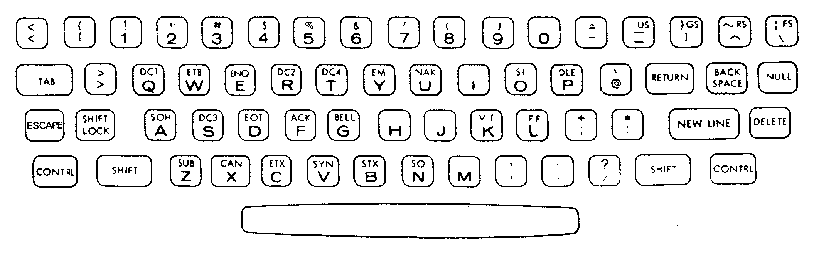
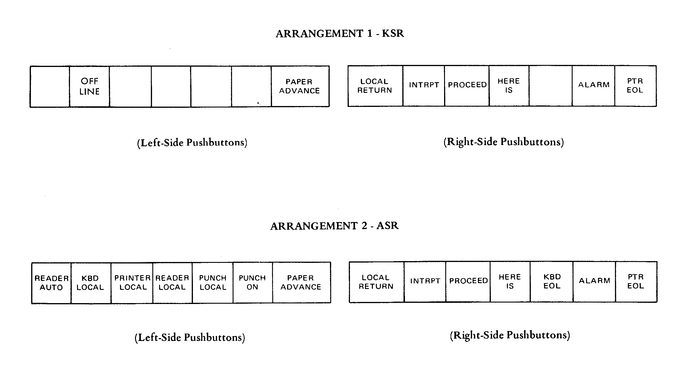

# Figures extracted from various manuals

## 37 KSR and ASR Teletypewriter Set for DATA-PHONE Service: General Description and Operation

Figure 6 - Keyboard Arrangement

Figure 7 - Typical Control Panel Arrangements

## 37 Typing Unit (37P003 and up): Description and Principles of Operation

Figure 63 - Visual Aid Overlay

## A Chemical Teletype

Figure 1. Basic chemical symbols

Figure 2. Locations of chemical symbols on type pallet. The frame represents the
normal size of the type pallet. To accomodate the symbols outside the frame, the
pallets had to be extended

Figure 3. The 8-row type basket with chemical symbols

Figure 4. Detail of type basket, showing extended symbols overlapping a
sacrificed space

*omitted*

Figure 5. Keystroke comparisons—Teletype *vs.* Mullen machine

Figure 6. View of Teletype keyboard

Figure 7. Teletype keyboard layout

*omitted*

Figure 8. Teletype code chart
